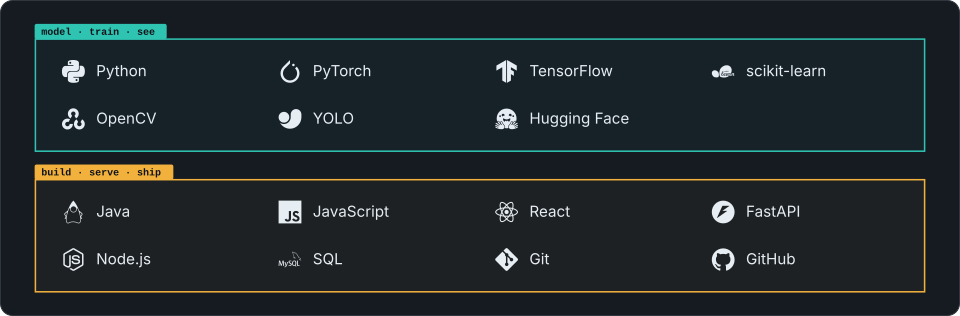

 

I build models that see, and the software that puts them to work. 
AI/ML through research, real products, and open source.

 

 

<table>
  <tr>
    <td>FOCUS</td>
    <td>Machine learning · Deep learning · Computer vision · Generative AI</td>
  </tr>
  <tr>
    <td>RESEARCH</td>
    <td>Deep learning · Computer vision · Edge AI — IIT Bhilai</td>
  </tr>
  <tr>
    <td>ELSEWHERE</td>
    <td>
      <a href="https://www.linkedin.com/in/ashmita-das-a788a7325/">LinkedIn</a>
      &nbsp;·&nbsp;
      <a href="mailto:adas64864@gmail.com">Email</a>
      &nbsp;·&nbsp;
      <a href="https://github.com/Galax1513?tab=repositories">Repositories</a>
    </td>
  </tr>
</table>
